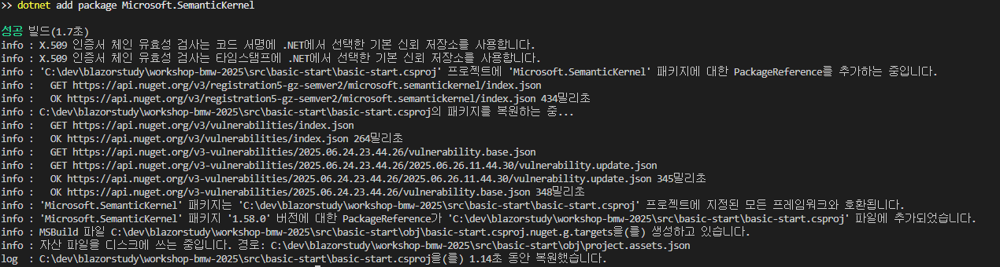
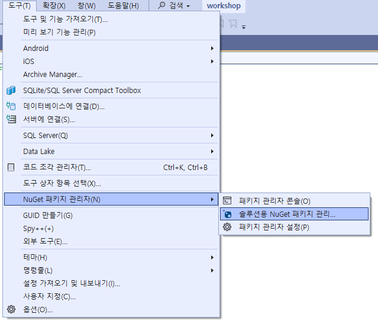
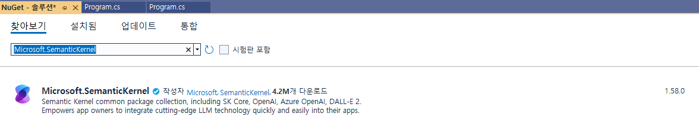

## 세션 목표
- Semantic Kernel의 기본을 읽혀 보자
- 콘솔 어플리케이션 앱에서 Semantic Kernel을 이용해 간단한 질문을 해보자

## 프로젝트 시작 위치
다음 위치의 시작 프로젝트가 있습니다.
- src/basic-start

## Semantic Kernel Basics
1. Visual Studio Code의 경우
	- 프로젝트 파일이 있는 위치에서 다음 명령어를 통해 추가합니다.
	```bash
	dotnet add package Microsoft.SemanticKernel
	```
	다음 이미지와 같이 진행됩니다.

	

1. Visual Studio의 경우
	1. 아래와 같이 NuGet 패키지 관리 창을 엽니다.

	

	아래와 같이 Microsoft.SemanticKernel을 검색하여 설치합니다.

	

1. 다음과 같이 Kernel을 만듭니다. 만들어진 kernel을 통해 모든 동작을 진행합니다.
```cs
var kernel = Kernel.CreateBuilder()
			.AddAzureOpenAIChatClient( deployname, endpoint, apiKey)
			.Build();
```
1. 이번에는 AzureOpenAI를 사용하였지만 OpenAI, GitHub Models 등 편하신 서비스에 접근하시면 됩니다.

1. 실습을 위해 다음 정보를 이용하세요.
```cs
var deployname = "gpt-4o-mini";
var endpoint = "https://blazormeetup.openai.azure.com";
var apiKey = "f09bbed482e84d30999f935effe34430";
```

1. 혹시 자동으로 using이 생기지 않으면 입력해 주시면 됩니다.
```cs
using Microsoft.SemanticKernel;
```

1. 이제 AI에게 뭔가 물어볼 차례입니다. Semantic Kernel이 무엇인지 물어보죠.
```cs
var prompt = "Semantic Kernel이 무엇인가요?";
Console.WriteLine( prompt );

var response = await kernel.InvokePromptAsync(prompt);
Console.WriteLine(response);
```

1. 실행하여 확인해 봅니다.
	1. Visual Studio Code의 경우
		-프로젝트 디렉토리에서 다음 명령어 실행
		```bash
		dotnet run
		```
	1. Visual Studio인 경우
		- F5를 눌러서 평소와 같이 실행

## 꼭 알고 넘어가야 할 것들
- Microsoft.SemanticKernel nuget package를 설치해야 합니다.
- Kernel을 만들어 사용합니다.
- Prompt Invoke를 호출하면 됩니다.
