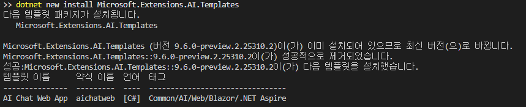
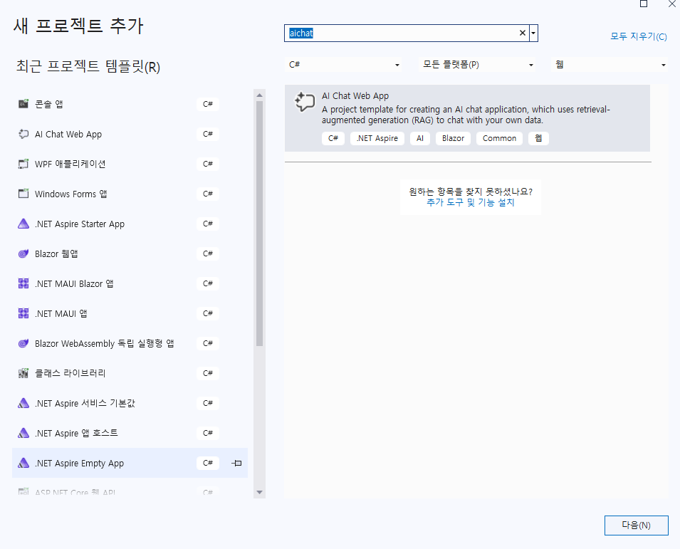
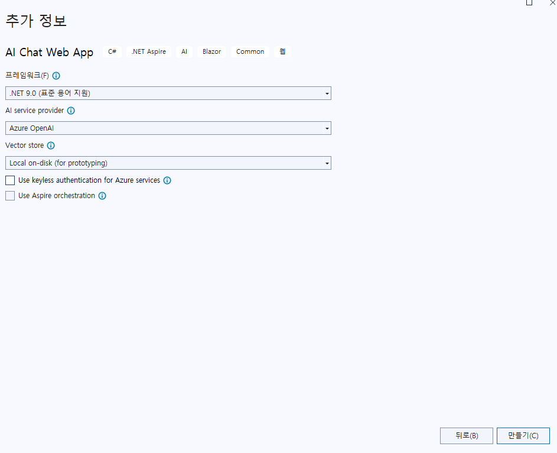

## 세션 목표
- .NET Extension AI Template를 알아보자

## 프로젝트 시작 위치
- 솔루션 위치에서 프로젝트를 생성합니다.
- 실습을 위해서는 .NET 9이 설치되어 있어야 합니다.


## .NET AI Template 실습
1. .NET Extension AI Template 설치를 위해 다음 명령어를 실행합니다.
```bash
dotnet new install Microsoft.Extensions.AI.Templates
```
다음 이미지와 같이 진행됩니다.



1. 새로운 프로젝트를 추가해 주세요.
	1. Visual Studio Code의 경우 솔루션 파일이 있는 위치에서 다음 명령어를 실행해 주세요.
	```bash
	dotnet new aichatweb --name template-start --provider azureopenai --vector-store local --managed-identity false
	```

	1. Visual Studio의 경우 다음과 같이 진행해 주세요.
		1. 신규 프로젝트를 추가해 주세요.

		

		1. 생성 위치를 결정하고 다음 그림과 같이 옵션을 선택합니다. 필요해 따라 다르게 선택하셔도 됩니다.

		


1. programs.cs 파일에 AzureOpenAI의 api key를 추가합니다. 17번째 행부터 다음과 같이 수정해 주세요.
	```cs
	var azureOpenAi = new AzureOpenAIClient(
	new Uri("https://blazormeetup.openai.azure.com"),
	new ApiKeyCredential("f09bbed482e84d30999f935effe34430"));
	```

1. 실행하여 확인해 봅니다.
	1. Visual Studio Code의 경우
		-프로젝트 디렉토리에서 다음 명령어 실행
		```bash
		dotnet run
		```
	1. Visual Studio인 경우
		- F5를 눌러서 평소와 같이 실행

	1. '응급구조키트의 내용을 알려줘'와 같은 질문을 해보세요.

## 꼭 알고 넘어가야 할 것들
- AI 웹앱을 만들기 위한 템플릿이 있습니다.
